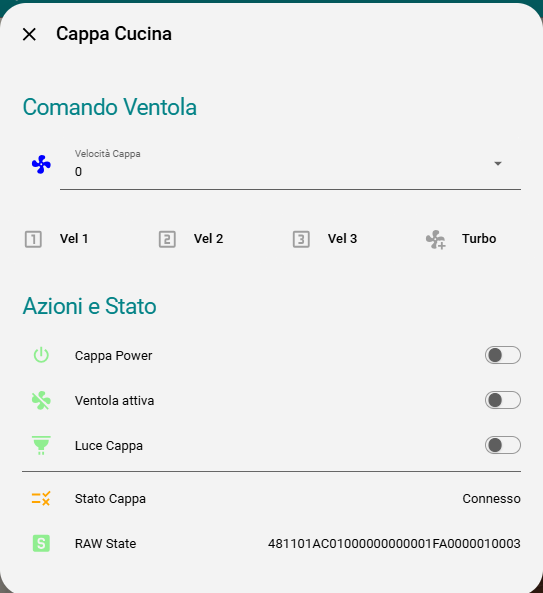

# KKT KOLBE Hood → Home Assistant (Hekr cloud bridge)

Control a **KKT KOLBE** range hood (and likely other **Hekr / WISEN** WiFi
appliances) from **Home Assistant** — **without any hardware modification**.

KKT discontinued the WISEN app, leaving these hoods half-bricked: the WiFi
still works, but there's no official way to control them anymore. This project
puts a small transparent proxy between the hood and the Hekr cloud, exposing
the hood to Home Assistant over MQTT with auto-discovery.

> No soldering, no flashing, no opening the hood. Pure network-side software.



## Features

- Transparent MITM proxy: hood ↔ **bridge** ↔ Hekr cloud
- Home Assistant **MQTT auto-discovery** (switch, select, fan, sensors)
- Inject commands (power / light / speed) toward the hood
- Live logging of the full Hekr JSON protocol for further reverse engineering
- Interactive REPL to map unknown command IDs
- Runs as a tiny Docker container

## Entities exposed in Home Assistant

| Entity | Type | Notes |
|---|---|---|
| Power | `switch` | master on/off (fan + light) — cmdId `0x02` |
| Light | `switch` | light only — cmdId `0x03` |
| Speed | `select` | 0 / 1 / 2 / 3 / 4 — cmdId `0x04` |
| Fan | `fan` | same as speed, exposed as a fan with percentage |
| Connected | `binary_sensor` | online / offline |
| Raw state | `sensor` | last raw hex frame (diagnostic) |
| Sequence | `sensor` | device frame counter (diagnostic) |

---

## How it works

The hood contains an **ESP-based Hekr WiFi module**. It opens a plain-text TCP
connection to the Hekr cloud (no TLS) and exchanges line-delimited JSON:

```
device  -> cloud : {"msgId":..,"action":"heartbeat"}
device  -> cloud : {"msgId":..,"action":"devSend","params":{... "raw":"4811..."}}
cloud   -> device: {"msgId":..,"action":"appSend","params":{... "raw":"4807..."}}
```

- `devSend.raw` is the **status** frame the hood reports.
- `appSend.raw` is a **command** the cloud sends to the hood.
- Each `raw` is a short binary payload, hex-encoded.

By redirecting the hood's cloud traffic to this bridge (a single DNAT rule on
your router), the bridge can read every status update and inject its own
commands, while still forwarding everything to the real cloud so the hood keeps
working normally.

### Status frame layout (KKT KOLBE FREE)

17 bytes, e.g. `4811 01 23 01 01 00 01 02 00 01 FA 00 00 01 00 7E`:

| Offset | Meaning |
|---|---|
| 0 | `0x48` magic |
| 1 | length (`0x11` = 17) |
| 2 | frame type |
| 3 | sequence counter |
| 6 | light (0/1) |
| 7 | **speed (0..4)** |
| 9–14 | filter / counter block |
| 16 | checksum = `sum(prev bytes) & 0xFF` |

### Command frame layout

7 bytes: `48 07 02 [seq] [cmdId] [value] [chk]`, checksum = `sum & 0xFF`.

| cmdId | Function |
|---|---|
| `0x02` | master power (fan + light) |
| `0x03` | light on/off |
| `0x04` | fan speed (value 0..4) |

> Other models may use different command IDs. Use the REPL (below) to map them.

---

## Setup

### Requirements

- A hood using the Hekr cloud (WISEN app), reachable on your LAN
- A router where you can add a **DNAT** rule (examples: UniFi, OpenWrt, pfSense)
- An MQTT broker (e.g. Mosquitto)
- Home Assistant with the MQTT integration enabled
- Docker + Docker Compose on a host on your network

### 1. Find your device identifiers

You need three things: the **device IP**, the **devTid**, and the **ctrlKey**.

Capture the hood's traffic (run on the router, or any host that can mirror it):

```bash
tcpdump -i any -nn -s 0 -w hood.pcap 'host <DEVICE_IP>'
```

While capturing, toggle the hood from the WISEN app (or power-cycle it). Then
inspect the JSON (the payloads are plain ASCII):

```bash
tshark -r hood.pcap -Y 'tcp.len > 0' -T fields -e tcp.payload \
  | while read p; do printf "%b\n" "$(echo "$p" | sed 's/\(..\)/\\x\1/g')"; done
```

You'll see lines like:

```json
{"action":"devSend","params":{"devTid":"ESP_2M_AABBCCDDEEFF", ...}}
{"action":"appSend","params":{"devTid":"ESP_2M_AABBCCDDEEFF",
  "ctrlKey":"<32 hex chars>", ...}}
```

- `devTid` → `HEKR_DEV_TID`
- `ctrlKey` → `HEKR_CTRL_KEY`
- the IP the device connects to (`tcp.dstport == 83`) → `HEKR_CLOUD_HOST`

### 2. Configure

```bash
git clone https://github.com/markobel/kkt-kolbe-homeassistant.git
cd kkt-kolbe-homeassistant
cp .env.example .env
# edit .env with your devTid, ctrlKey, MQTT credentials, etc.
nano .env
```

### 3. Redirect the hood to the bridge (DNAT)

Send the hood's cloud traffic to the host running the bridge. Replace IPs/ports
to match your setup.

**Generic iptables (run on the router):**

```bash
iptables -t nat -A PREROUTING \
  -s <DEVICE_IP> -d <HEKR_CLOUD_HOST> \
  -p tcp --dport 83 \
  -j DNAT --to-destination <BRIDGE_HOST_IP>:83
```

**UniFi (UDR/UDM)** — make it persistent with `on_boot.d`
(requires [unifios-utilities](https://github.com/unifi-utilities/unifios-utilities)).
Create `/data/on_boot.d/15-hekr-redirect.sh`:

```sh
#!/bin/sh
iptables -t nat -C PREROUTING -s <DEVICE_IP> -d <HEKR_CLOUD_HOST> \
  -p tcp --dport 83 -j DNAT --to-destination <BRIDGE_HOST_IP>:83 2>/dev/null || \
iptables -t nat -A PREROUTING -s <DEVICE_IP> -d <HEKR_CLOUD_HOST> \
  -p tcp --dport 83 -j DNAT --to-destination <BRIDGE_HOST_IP>:83
```

```bash
chmod +x /data/on_boot.d/15-hekr-redirect.sh
/data/on_boot.d/15-hekr-redirect.sh
```

> If your hood is on a separate VLAN, also allow the forward between the hood
> and the bridge host for tcp/83.

### 4. Run

```bash
docker compose up -d --build
docker compose logs -f hekr-bridge
```

Force the hood to reconnect so it picks up the new route (power-cycle it, or
flush the existing connection on the router, e.g. `conntrack -D -s <DEVICE_IP>`).

You should see:

```
Hekr bridge listening on 0.0.0.0:83 -> <HEKR_CLOUD_HOST>:83
MQTT: connected to ...
MQTT: published 7 HA discovery entities
=== DEVICE CONNECT from ('<DEVICE_IP>', ...) ===
=== CLOUD CONNECT to <HEKR_CLOUD_HOST>:83 ok ===
STATE CHG: ...
```

The device appears in Home Assistant under **Settings → Devices & Services →
MQTT**.

---

## Mapping more commands (REPL)

The container runs an interactive REPL. Attach to it:

```bash
docker attach hekr-bridge      # detach with Ctrl+P then Ctrl+Q (NOT Ctrl+C)
```

Then experiment:

```
speed 1
speed 0
light 1
cmd 05 01      # try unknown command id 0x05 with value 1
state
```

Watch the `STATE CHG` lines to see which byte changes, and map new features
(RGB, filter reset, timer, etc.) for your model. Contributions welcome!

---

## Notes & caveats

- The bridge still relies on the **real Hekr cloud** being reachable, because
  it forwards the login/handshake. If the cloud ever goes away, the captured
  handshake (`devLoginResp` → `reportDevInfoResp` → `getTimerListResp`) is
  enough to emulate it locally — PRs welcome.
- The `uart timeout` responses you may see are cosmetic on this hardware: the
  command is executed and the hood reports the new state regardless.
- Plain-text TCP, no TLS, no certificate pinning observed on the KKT KOLBE FREE.
  Your model may differ.

## Disclaimer

This is an unofficial, community project. Not affiliated with KKT KOLBE or
Hekr. Use at your own risk. You are responsible for complying with the terms of
service of any cloud you interact with and with applicable laws.

## License

MIT — see [LICENSE](LICENSE).
